# Resu

```diff
+ LEFT click to download zip-> unzip -> Save As -> plugins/Resu/

```
------
#### [AriadnesThreadPlugin.cs](https://minhaskamal.github.io/DownGit/#/home?url=https://github.com/User5981/Resu/blob/master/AriadnesThreadPlugin.cs)
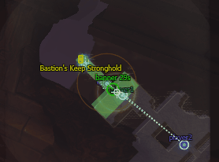 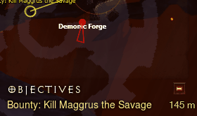 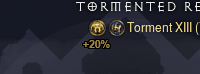
- Two players in the same area/map : Draws a thread between you and the other player on the minimap. 
- Three players in the same area/map : Draws a triangle formed by you and the two other players on the minimap.
- Four players in the same area/map : Draws a triangle formed by the three other players on the minimap.
- Strength in numbers buff % indicator
- Blue line between me and Boss (from Xenthalon's AdvancedMarkerPlugin)
- Purple line between me and KeyWarden (from Xenthalon's AdvancedMarkerPlugin)
- Yellow line between me and Quest (Bounties) (from Xenthalon's AdvancedMarkerPlugin)
- Green line between me and Banner (with nearest player's name for teleporting + countdown + banners now stay 30s instead of 10s)
- White line between me and Pools of reflection (optional, disabled by default).
- Bounty distance in yards or (optional) meters.
- Speed in mph or km/h.

<p><details>
<summary>Customization (paste this in the Customization part of User/PluginEnablerOrDisablerPlugin.cs)</summary>
	
```C#
// AriadnesThreadPlugin Customization
               Hud.RunOnPlugin<Resu.AriadnesThreadPlugin>(plugin => 
            { 
               
	    plugin.ThreadBetweenPlayers = true; // Set to false to disable the thread between players.
	    plugin.Pools = false; // Set to true to enable pools of reflection.
            plugin.BannerTimeSeconds = 30; // Number of seconds you want each player's banner to stay.
            plugin.MetricSystem = false; // Set to true to use metric system for bounty distance.
            });  
// End of AriadnesThreadPlugin Customization
```
</details></p>

------

#### [BattleTagAboveBannerPlugin.cs](https://minhaskamal.github.io/DownGit/#/home?url=https://github.com/User5981/Resu/blob/master/BattleTagAboveBannerPlugin.cs)
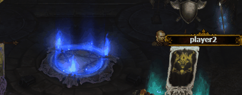
- Adds other players' battletags above banners when they aren't in town.
<p><details>
<summary>Customization (paste this in the Customization part of User/PluginEnablerOrDisablerPlugin.cs)</summary>
	
```C#
// BattleTagAboveBannerPlugin Customization
               Hud.RunOnPlugin<Resu.BattleTagAboveBannerPlugin>(plugin => 
            { 
                
            plugin.SeePlayersInTown = false; 
            
            });  
// End of BattleTagAboveBannerPlugin Customization
```
</details></p>

------

#### [ChannelingPlugin.cs](https://minhaskamal.github.io/DownGit/#/home?url=https://github.com/User5981/Resu/blob/master/ChannelingPlugin.cs) - Plays a sound when resource is back to full, another when down to the set limit (customizable). :
Note : Don't forget to download the [Soundfiles](https://minhaskamal.github.io/DownGit/#/home?url=https://github.com/User5981/Resu/tree/master/sounds) and place them in TurboHUD's /sounds/ directory to have the notification sound.

Note 2 : [HotEnablerDisablerPlugin.cs](https://minhaskamal.github.io/DownGit/#/home?url=https://github.com/User5981/Resu/blob/master/HotEnablerDisablerPlugin.cs) is now MANDATORY to use this plugin.

<p><details>
<summary>Customization (paste this in the Customization part of User/PluginEnablerOrDisablerPlugin.cs)</summary>
	
```C#
// ChannelingPlugin Customization
               Hud.RunOnPlugin<Resu.ChannelingPlugin>(plugin => 
            { 
              plugin.ResourceMax = 100; // Resource % at which the HighNotification sound is played (also threshold for LowNotification to be replayed even if HighNotification is disabled)
              plugin.ResourceMin = 15; // Resource % at which the LowNotification sound is played (also threshold for HighNotification to be replayed even if LowNotification is disabled)
              plugin.DisciplineMax = 100; // Discipline % at which the HighNotification sound is played (also threshold for LowNotification to be replayed even if HighNotification is disabled)
              plugin.DisciplineMin = 15; // Discipline % at which the LowNotification sound is played (also threshold for HighNotification to be replayed even if LowNotification is disabled)
              plugin.HatredMax = 100; // Hatred % at which the HighNotification sound is played (also threshold for LowNotification to be replayed even if HighNotification is disabled)
              plugin.HatredMin = 15; // Hatred % at which the LowNotification sound is played (also threshold for HighNotification to be replayed even if LowNotification is disabled)	      
	      plugin.HighNotification = true; // Play HighNotification
	      plugin.LowNotification = true; // Play LowNotification
	      
            });  
// End of ChannelingPlugin Customization
```

</details></p>

------

#### [CloudofBatsPlugin.cs](https://minhaskamal.github.io/DownGit/#/home?url=https://github.com/User5981/Resu/blob/master/CloudofBatsPlugin.cs)
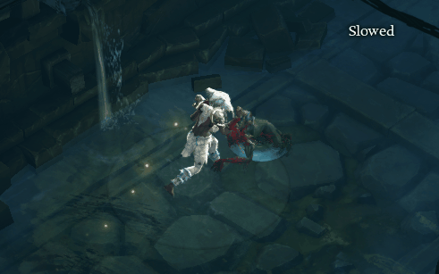
- Draws the Cloud of Bats range circle when hero is in combat.

------

#### [CrierSellerPlugin.cs](https://minhaskamal.github.io/DownGit/#/home?url=https://github.com/User5981/Resu/blob/master/CrierSellerPlugin.cs) 
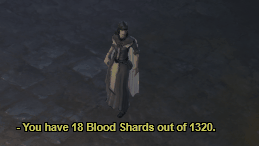
- The Blacksmith, Mystic, Jeweller, Kadala & Kulle give useful (or not) infos when the hero approaches.

------

#### [DangerPlugin.cs](https://minhaskamal.github.io/DownGit/#/home?url=https://github.com/User5981/Resu/blob/master/DangerPlugin.cs) - Adds : 
Note : [HotEnablerDisablerPlugin.cs](https://minhaskamal.github.io/DownGit/#/home?url=https://github.com/User5981/Resu/blob/master/HotEnablerDisablerPlugin.cs) is now MANDATORY to use this plugin.
- Circles around Blood springs on the floor and on the minimap (Paths of the Drowned & Blood Marsh area)(previously BloodSpringsPlugin).
- Circles around Shock Towers on the floor and on the minimap (from DM's ShockTowerPlugin).
- Triangles around Demon Forges flames on the floor and indicator on the minimap (heavily modified DM's DemonForgePlugin).
- Circles around Arcane enchanted.
- Circles around Demon Mines.
- Circles under Orbiters within 10 yards.
- Thunderstorm, Plagued, Molten, PoisonDeath, MoltenExplosion, Morlu's Meteor & Desecrator move! warnings when player is exposed.
- Crosses on the ground for poison enchanted.
- SandWasp's Projectile indicator. 

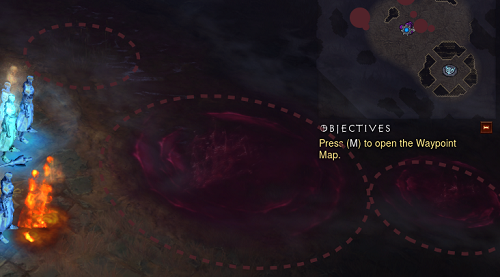 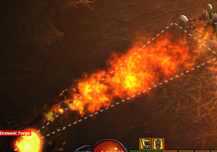

<p><details>
<summary>Customization (paste this in the Customization part of User/PluginEnablerOrDisablerPlugin.cs)</summary>
	
```C#
// DangerPlugin Customization
               Hud.RunOnPlugin<Resu.DangerPlugin>(plugin => 
            { 
               // set to false; the items you don't want to see 
            plugin.BloodSprings = true; 
            plugin.DemonicForge = true;
            plugin.ShockTower = true;
            plugin.Desecrator = true;
            plugin.Thunderstorm = true;
            plugin.Plagued = true;
            plugin.Molten = true;
            plugin.ArcaneEnchanted = true;
            plugin.PoisonEnchanted = true;
	    plugin.GasCloud = true; // (Ghom)
	    plugin.SandWaspProjectile = true;
	    plugin.MorluSpellcasterMeteorPending = true;
	    plugin.DemonMine = true;
	    plugin.PoisonDeath = true;
	    plugin.MoltenExplosion = true;
	    plugin.Orbiter = true;
	    plugin.GrotesqueExplosion = true;
            plugin.BetrayedPoisonCloud = true;
            });  
// End of DangerPlugin Customization
```
</details></p>

------

#### [DarkerDiablo3Plugin.cs](https://minhaskamal.github.io/DownGit/#/home?url=https://github.com/User5981/Resu/blob/master/DarkerDiablo3Plugin.cs) 
Simple color filter that kills shiny colors and brings a darker Diablo 3. 

------

#### [DeluxeShrineLabelsPlugin.cs](https://minhaskamal.github.io/DownGit/#/home?url=https://github.com/User5981/Resu/blob/master/DeluxeShrineLabelsPlugin.cs) 

It's Psycho's ShrineLabelsPlugin with new features :
- "Leave for" message if you haven't nemesis and some other players have.
- "HIT ME!" message if you have nemesis equipped.
- Auto displays Healing Wells & Pools of reflection when health is under 1/3 (toggleable, on by default)

<p><details>
<summary>Customization (paste this in the Customization part of User/PluginEnablerOrDisablerPlugin.cs)</summary>
	
```C#
// DeluxeShrineLabelsPlugin Customization
               Hud.RunOnPlugin<Resu.DeluxeShrineLabelsPlugin>(plugin =>      
          {
                //Enable permanent Healing Well display
                plugin.ShowHealingWells = true;

                //Enable permanent Pool of reflection display
                plugin.ShowPoolOfReflection = true;

                // Disable displaying Healing Wells & Pools of reflection only when health is under 40%
		plugin.ShowAllWhenHealthIsUnder40 = false;
		
                //Change Pylon Short Name Example
                plugin.ShrineCustomNamesShort[ShrineType.BanditShrine] = "**BANDIT**";

                //Change Pylon Minimap Name Example
                plugin.ShrineCustomNames[ShrineType.BanditShrine] = "OMG A BANDIT SHRINE";

                //Change Pylon Minimap Decorator Example
                //CreateMapDecorators(Font Size, Saturation(0-255), Red(0-255), Green(0-255), Blue(0-255), Radius Offset)
                plugin.ShrineDecorators[ShrineType.BanditShrine] = plugin.CreateMapDecorators(8,255,255,0,0,5);

                //Change Pylon Ground Label Decorator Example
                //CreateGroundLabelDecorators(Font Size, Saturation(0-255), Red(0-255), Green(0-255), Blue(0-255), Bg Saturation(0-255), Bg Red(0-255), Bg Green(0-255), Bg Blue(0-255) )
                plugin.ShrineShortDecorators[ShrineType.BanditShrine] = plugin.CreateGroundLabelDecorators(8,255,255,0,0,255,0,0,0);
            }); 
// End of DeluxeShrineLabelsPlugin Customization
```
</details></p>

------

#### [DeluxeInventoryFreeSpacePlugin.cs](https://minhaskamal.github.io/DownGit/#/home?url=https://github.com/User5981/Resu/blob/master/DeluxeInventoryFreeSpacePlugin.cs) 
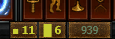

It's the default InventoryFreeSpacePlugin with new features :
- Space left in inventory for 2 slot items.
```diff
-  Open inventory once to get the value instead of the question mark.
```

------

#### [EquippedItemDurabilityPlugin.cs](https://minhaskamal.github.io/DownGit/#/home?url=https://github.com/User5981/Resu/blob/master/EquippedItemDurabilityPlugin.cs) 
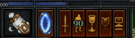

Indicates Equipped Items durability (helps to know when to repair).

------

#### [CraftCountPlugin.cs](https://minhaskamal.github.io/DownGit/#/home?url=https://github.com/User5981/Resu/blob/master/CraftCountPlugin.cs) 
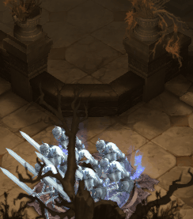 

Displays total amount of :
- Death's breath
- Veiled Crystal 
- Blood Shards 
- Reusable Parts
- Arcane Dust 
- Forgotten Soul
- Greater rift Keystone
- Bovine Bardiche
- Puzzle Ring
- Hellfire crafts
- Bounty crafts
- Bounties left
- Rift completion % (around 25%, 50%, 75% and above 90%) 

...Above player when total amount changes.

------

#### [CraftersDelightPlugin.cs](https://minhaskamal.github.io/DownGit/#/home?url=https://github.com/User5981/Resu/blob/master/CraftersDelightPlugin.cs) - Shows on mini map :
Note : Don't forget to download the [Soundfiles](https://minhaskamal.github.io/DownGit/#/home?url=https://github.com/User5981/Resu/tree/master/sounds) and place them in TurboHUD's /sounds/ directory to have notification sounds on Ancient & Primal drops, Horadric cache drop, same item as equipped drop.
- Death's Breath 
- Veiled Crystal 
- Arcane Dust 
- Forgotten Soul 
- Bovine Bardiche 
- Puzzle Ring 
- Reusable Parts
- Gems (Marquise and Imperial only)
- Greater Rift Keystone
- Blood Shards
- ramaladni's gift
- potions
- infernal machines
- Bounty crafts
- Hellfire crafts
- legendary gems
- Horadric Caches
- Item not yet cubed (minimap)
- Chests & lores (minimap) 
- Ancient and Primal indicator on legendary or set icons (minimap).
- Same item as equipped or in cube (only for ancients) : indicator on minimap (E) & lines around item in inventory / stash.
- Same item as in Armory (only for ancients) : indicator on minimap (⚔).
- Noob Gear Mode : Displays White, Blue, Yellow stars on floor & minimap if the Normal/Magic/Rare item dropped has better quality than your worst quality item equipped. 

...And adds transparent colored groundlabel names with quantity for all + Slain Farmers (discrete and ground label only) except Bovine Bardiche & Puzzle Ring (already in ItemsPlugin).

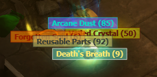  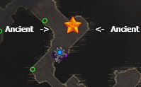

Advice: For better experience with this plugin, turn off "Always Show Items Labels On Drop" in the Diablo 3 Gameplay options.

<p><details>
<summary>Customization (paste this in the Customization part of User/PluginEnablerOrDisablerPlugin.cs)</summary>
	
```C#
// CraftersDelightPlugin Customization
               Hud.RunOnPlugin<Resu.CraftersDelightPlugin>(plugin => 
            { 
               // set to false; the items you don't want to see 
            plugin.ShowAncientRank = true; 
            plugin.SlainFarmers = true;
            plugin.DeathsBreath = true;
            plugin.VeiledCrystal = true;
            plugin.ArcaneDust = true;
            plugin.Gems = true;
            plugin.ForgottenSoul = true;
            plugin.ReusableParts = true;
            plugin.GreaterRiftKeystone = true;
            plugin.BovineBardiche = true;
            plugin.PuzzleRing = true;
            plugin.BloodShards = true;
            plugin.RamaladnisGift = true;
            plugin.Potion = true;
            plugin.InfernalMachine = true;
            plugin.Bounty = true;
            plugin.HellFire = true;
            plugin.LegendaryGems = true;
            plugin.HoradricCaches = true;
            plugin.LoreChestsDisplay = true;
            plugin.NormalChestsDisplay = true;
            plugin.ResplendentChestsDisplay = true;
	    plugin.GroupGems = true; // set to false to group gems by type, set to true to group all gems
            plugin.Equipped = true; // set to false to turn off "same item as equipped" drop sound drop & rendering on minimap & inventory.
	    plugin.NoobGearMode = true; // set to false to turn off Noob Gear Mode.
            });  
// End of CraftersDelightPlugin Customization
```
</details></p>

------

#### [CustomLifeWarningPlugin.cs](https://minhaskamal.github.io/DownGit/#/home?url=https://github.com/User5981/Resu/blob/master/CustomLifeWarningPlugin.cs) - Turns the screen progressively to transparent orange when life percentage goes under the set limit. Default is 50%. Displays health globes on ground & minimap when health percentage is below an user selected value (40 by default). Absorb shield indicator on life globe.
Note : [HotEnablerDisablerPlugin.cs](https://minhaskamal.github.io/DownGit/#/home?url=https://github.com/User5981/Resu/blob/master/HotEnablerDisablerPlugin.cs) is now MANDATORY to use this plugin.

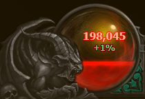 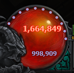

<p><details>
<summary>Customization (paste this in the Customization part of User/PluginEnablerOrDisablerPlugin.cs)</summary>
	
```C#
// Settings for Custom Life Warning Plugin
               Hud.RunOnPlugin<Resu.CustomLifeWarningPlugin>(plugin => 
            { 
                    // Sets the life % limit under which you want the warning
                     plugin.lifePercentage = 50;
                    // Sets the life % limit under which you want to see health globes on ground & minimap
		    plugin.lifePercentageToDisplayGlobes = 40;
            });  
// End of Settings for Custom Life Warning Plugin
```
</details></p>

------

#### [GroupGRLevelAdviserPlugin.cs](https://minhaskamal.github.io/DownGit/#/home?url=https://github.com/User5981/Resu/blob/master/GroupGRLevelAdviserPlugin.cs) 
- Displays an advised group GRift level when rift dialogue is open.
- When Rift or Grift is over and all players are in town, the Nephalem Obelisk tells you you can close.
- Red circle around 5% of Rift completion monster groups on minimap.
- "Talk to Urshi" reminder when teleporting after Greater rift.
- Support for Z class (ZDPS, Sup). 
- Pack leader life percentage (toggleable, on by default).
- Countdown between the moment the Grift is completed 100% and the moment you can hit the boss (if boss is on screen) (toggleable, on by default).
- time left to boss fight in Grift bar (toggleable, on by default).

 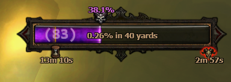
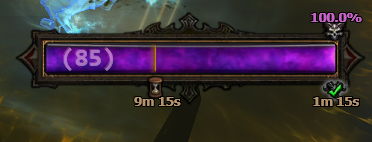

<p><details>
<summary>Customization (paste this in the Customization part of User/PluginEnablerOrDisablerPlugin.cs)</summary>
	
```C#
// Settings for Group GR Level Adviser Plugin
               Hud.RunOnPlugin<Resu.GroupGRLevelAdviserPlugin>(plugin => 
            { 
                    
                     plugin.RedCircle = True;                  // Set to false if you don't want the red circle
		     plugin.PackLeaderLifePercentage = True;   // Set to false if you don't want the life percentage on elites
		     plugin.TimeToGRBoss = true;               // Set to false if you don't want the time left to boss fight in Grift bar 
            });  
// End of Settings for Group GR Level Adviser Plugin
```
</details></p>

------

#### [HuntersVengeancePlugin.cs](https://minhaskamal.github.io/DownGit/#/home?url=https://github.com/User5981/Resu/blob/master/HuntersVengeancePlugin.cs) - Shows 1 circle around your player when you have Zei's stone of vengeance equipped and are fighting, it also displays the percentage of damage increased by the legendary gem under each monster (calculated from gem level and distance from your player), the circle and a visor appears on the minimap to help you to aim at distant monsters.
Note : [HotEnablerDisablerPlugin.cs](https://minhaskamal.github.io/DownGit/#/home?url=https://github.com/User5981/Resu/blob/master/HotEnablerDisablerPlugin.cs) is now MANDATORY to use this plugin.

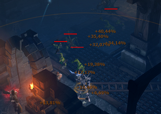 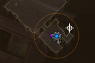

<p><details>
<summary>Customization (paste this in the Customization part of User/PluginEnablerOrDisablerPlugin.cs)</summary>
	
```C#
// Settings for Hunter's Vengeance Plugin
               Hud.RunOnPlugin<Resu.HuntersVengeancePlugin>(plugin => 
            { 
                     plugin.permanentCircle = false;      // Enable permanent circle : Set it to true;
                     plugin.ElitesOnlyNumbers = false;    // Enable numbers on elites only : Set it to true;
		     plugin.TargetForAll = true;          // Disable cursor on minimap for all : Set it to false;
            });  
// End of Settings for Hunter's Vengeance Plugin
```
</details></p>

------

#### [ImmortalKingsCallPlugin.cs](https://minhaskamal.github.io/DownGit/#/home?url=https://github.com/User5981/Resu/blob/master/ImmortalKingsCallPlugin.cs) - Shows when Immortal King's Call's +1500 damage buff is active and how many seconds are left.
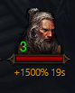

------

#### [NextHeroPlugin.cs](https://minhaskamal.github.io/DownGit/#/home?url=https://github.com/User5981/Resu/blob/master/NextHeroPlugin.cs) - If you like switch often to play with the hero that have the less hours of playing, that plugin will display the next hero to play with and the time gap between the two heroes when you are in town.
Heroes not in the same Hardcore/Softcore Seasonal/Regular mode will be ignored.

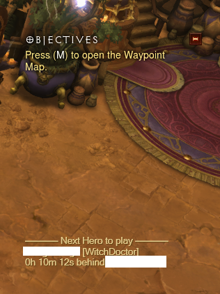

------

#### [ItemPerfectionPlugin.cs](https://minhaskamal.github.io/DownGit/#/home?url=https://github.com/User5981/Resu/blob/master/ItemPerfectionPlugin.cs) - displays :
- Check mark	: % item perfection
- Crossed swords :	% item offense orientation
- Shield :	% item defense orientation
- Globe :	% item resource orientation
- Heart :	% item life orientation
- Boot :	% item adventure orientation

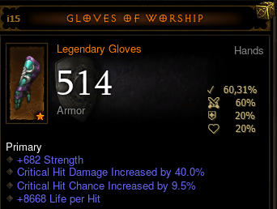

------

#### [ParagonPercentagePlugin.cs](https://minhaskamal.github.io/DownGit/#/home?url=https://github.com/User5981/Resu/blob/master/ParagonPercentagePlugin.cs) 
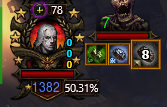 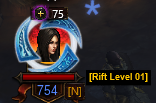 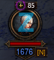
- Shows EXP percentage with two decimal right to portrait paragon level (a bit more precise than the top stats 2 decimals paragon level) with EXP/h & time to next paragon level in the hint and replaces portrait level 70 (only if reached) by each hero's highest Greater Rift level with Class, Sheet DPS, EHP and Nemesis Bracers [N] & Unity [U] indicator in the hint.
- Support for Z class (ZDPS, Sup).
- AFK indicator.

<p><details>
<summary>Customization (paste this in the Customization part of User/PluginEnablerOrDisablerPlugin.cs)</summary>
	
```C#
// Settings for Paragon Percentage Plugin
               Hud.RunOnPlugin<Resu.ParagonPercentagePlugin>(plugin => 
            { 
                plugin.ParagonPercentageOnTheRight = false; // set to true to display % on the left 
		plugin.ShowGreaterRiftMaxLevel = false; // set to true to disable GR level display
		plugin.DisplayParagonPercentage = true; // set to false to disable paragon percentage display
		plugin.NPCDeco = true; // set to false to disable NPC decorator
            });  
// End of settings for Paragon Percentage Plugin

 // Disable Top Experience Statistics
                           Hud.TogglePlugin<TopExperienceStatistics>(false); 
 // End of Disable Top Experience Statistics
```
</details></p>

------

#### [PotionPerfectionPlugin.cs](https://minhaskamal.github.io/DownGit/#/home?url=https://github.com/User5981/Resu/blob/master/PotionPerfectionPlugin.cs)
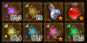
- Shows percentage of potion perfection on potion in stash and inventory. Not displayed when the potion is perfect. 
------

#### [PrimalAncientProbabilityPlugin.cs](https://minhaskamal.github.io/DownGit/#/home?url=https://github.com/User5981/Resu/blob/master/PrimalAncientProbabilityPlugin.cs)
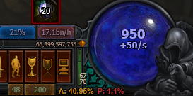 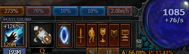
- Indicates Ancient & Primal Ancient drop probability.

------

#### [TimeEverywherePlugin.cs](https://minhaskamal.github.io/DownGit/#/home?url=https://github.com/User5981/Resu/blob/master/TimeEverywherePlugin.cs) - The default clock is hidden when your inventory is open which means you can't read it when spending time with the mystic, the jeweller and the blacksmith. You have 10mn left before going to school/work but can't see the time while you try to roll that good stat for your item? This plugin is for you, it displays time in your inventory when it's open.
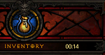

------

#### [UrshisGiftPlugin.cs](https://minhaskamal.github.io/DownGit/#/home?url=https://github.com/User5981/Resu/blob/master/UrshisGiftPlugin.cs) - Adds GR level for n% chance of upgrade on the bottom-right of your legendary gems in your stash and your inventory, maxed Gems are labelled "max", hint in itemhovered menu.The default setting is 100% chance for all 3 consecutive attempts.

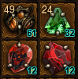 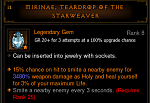

<p><details>
<summary>Customization (paste this in the Customization part of User/PluginEnablerOrDisablerPlugin.cs)</summary>
	
```C#
// Settings for UrshisGift Plugin
               Hud.RunOnPlugin<Resu.UrshisGiftPlugin>(plugin => 
            { 
                plugin.ChanceWantedPercentage = 100;  // % chance wanted : 100; 90; 80; 70; 60; 30; 15; 8; 4; 2; 1;
                plugin.NumberOfAttempts = 3;        // Number of consecutive attempts at this % : 1; 2; 3; (default) 4; (empowered GRift or no-death bonus) 5; (empowered GRift + no-death bonus)
                plugin.InventoryNumbers = true;    //show GRift level advised for the gem in inventory, stash, set to true; or false;
                plugin.HoveredNumbers = true;     //show upgrade hint on item hovered, set to true; or false;
            
            });  
// End of Settings for UrshisGift Plugin
```
</details></p>

------

#### [DiadrasFirstGemPlugin.cs](https://minhaskamal.github.io/DownGit/#/home?url=https://github.com/User5981/Resu/blob/master/DiadrasFirstGemPlugin.cs)

- Shows stacks & the percentage of damage increased by the legendary gem under each monster when you have Bane of the Stricken equipped. There's also a cooldown indicator. 
Note : [HotEnablerDisablerPlugin.cs](https://minhaskamal.github.io/DownGit/#/home?url=https://github.com/User5981/Resu/blob/master/HotEnablerDisablerPlugin.cs) is now MANDATORY to use this plugin.

<p><details>
<summary>Customization (paste this in the Customization part of User/PluginEnablerOrDisablerPlugin.cs)</summary>
	
```C#
// Settings for Diadra's First Gem Plugin
               Hud.RunOnPlugin<Resu.DiadrasFirstGemPlugin>(plugin => 
            { 
                    plugin.ElitesnBossOnly = false;
		    plugin.BossOnly = false;
		    plugin.offsetX = 0;
		    plugin.offsetY = 0;
            });  
// End of Settings for Diadra's First Gem Plugin
```
</details></p>

------

#### [HotEnablerDisablerPlugin.cs](https://minhaskamal.github.io/DownGit/#/home?url=https://github.com/User5981/Resu/blob/master/HotEnablerDisablerPlugin.cs) - This plugin allows you to disable a plugin by :
- Hero is Softcore
- Hero is Hardcore
- Hero is Seasonal
- Hero is NonSeasonal
- Hero class
- Hero Name

The plugin developper has just to add these (unchanged) three lines at the begining of the rendering part to make it compatible, (thereafter the plugin will throw an exception if this plugin is not present) :
```C#
var hedPlugin = Hud.GetPlugin<HotEnablerDisablerPlugin>();
bool GoOn = hedPlugin.CanIRun(Hud.Game.Me,this.GetType().Name); 
if (!GoOn) return;
```
<p><details>
<summary>Customization (paste this in the Customization part of User/PluginEnablerOrDisablerPlugin.cs)</summary>
	
```C#
// Settings for Hot Enabler/Disabler Plugin
// One line per plugin, case sensitive 
               Hud.RunOnPlugin<Resu.HotEnablerDisablerPlugin>(plugin => 
            { 
		plugin.DisableThatGameMode.Add("NameOfThePlugin","Hardcore"); // This disables the plugin NameOfThePlugin for all Hardcore Heroes. 1 entry possible, 2 options : Hardcore Softcore 
		plugin.DisableThatGameType.Add("RandomPlugin","Seasonal"); // This disables the plugin RandomPlugin for all Seasonal Heroes. 1 entry possible, 2 options : Seasonal NonSeasonal 
		plugin.DisableTheseHeroClasses.Add("AnotherPlugin","DemonHunter Necromancer"); // This disables the plugin AnotherPlugin for all DemonHunter & Necromancer Heroes. Many entries possible for one plugin, separated by spaces : DemonHunter Barbarian Wizard WitchDoctor Monk Crusader Necromancer 
		plugin.DisableTheseHeroNames.Add("YetAnotherPlugin","IncredibleMe"); // This disables the plugin YetAnotherPlugin for the Hero named IncredibleMe. Many entries possible for one plugin, separated by spaces. 
		});	
// End of Settings for Hot Enabler/Disabler Plugin
```
</details></p>

------

#### [OtherPlayersHeadsPlugin.cs](https://minhaskamal.github.io/DownGit/#/home?url=https://github.com/User5981/Resu/blob/master/OtherPlayersHeadsPlugin.cs) 
 
- Other players' heroes' face on minimap (helps identifying hero class at a glance) & optional followers display (on by default).
- Support for Z class (ZDPS, Sup). 

<p><details>
<summary>Customization (paste this in the Customization part of User/PluginEnablerOrDisablerPlugin.cs)</summary>
	
```C#
// Settings for Other Player's Heads Plugin
               Hud.RunOnPlugin<Resu.OtherPlayersHeadsPlugin>(plugin => 
            { 
                    plugin.ShowCompanions = true; // set to false to not display companions
            });  
// End of Settings for Other Player's Heads Plugin
```
</details></p>

------

#### [UnscathedMonsterShowerPlugin.cs](https://minhaskamal.github.io/DownGit/#/home?url=https://github.com/User5981/Resu/blob/master/UnscathedMonsterShowerPlugin.cs)
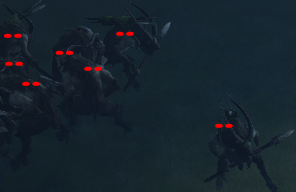
- Displays red eyes for unscathed monsters to help to see them in the dark or aim from afar.
